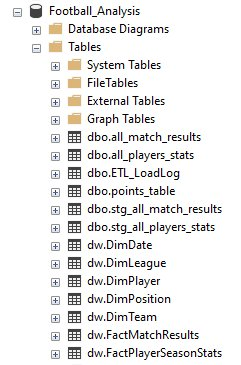
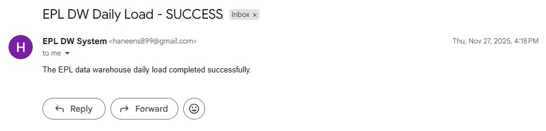
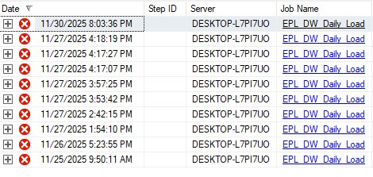

# EPL Data Warehouse & Automated ETL Pipeline

> **Course:** SIS314 Advanced Databases — Cairo University, Faculty of Computers and Artificial Intelligence
> **Instructor:** Dr. Shaimaa Galal

---

## Table of Contents

1. [Project Overview](#project-overview)
2. [Motivation & Business Questions](#motivation--business-questions)
3. [Data Source](#data-source)
4. [Architecture & Pipeline](#architecture--pipeline)
5. [OLTP Source System](#oltp-source-system)
6. [Star Schema Design](#star-schema-design)
7. [ETL Pipeline](#etl-pipeline)
8. [SCD Type 6](#scd-type-6)
9. [Automation & Alerting](#automation--alerting)
10. [Repository Structure](#repository-structure)
11. [How to Run](#how-to-run)
12. [Proof of Execution](#proof-of-execution)
13. [Technologies Used](#technologies-used)

---

## Project Overview

This project implements a full end-to-end **Data Warehouse** for the English Premier League (EPL) 2021–2022 season using **SQL Server** and **T-SQL**. It covers the complete data engineering pipeline — from raw CSV ingestion through staging, cleaning, dimensional modelling, automated daily loading, historical change tracking, and email alerting.

The warehouse is built on a **Star Schema** and is designed to support fast, flexible analytical queries that would be slow or impossible to run efficiently against the original OLTP source tables.

---

## Motivation & Business Questions

The raw EPL dataset contains rich information about matches, teams, and players — but it exists as flat transactional tables that are not optimized for analysis. Running analytics directly on this data presents several challenges:

- Player statistics, match results, and team standings exist in **separate tables** not optimized for analytical joins
- There is **no historical tracking** of how team positions or points change over time
- Complex aggregations across teams, players, and time require **multiple expensive joins** on an OLTP system not designed for that workload

To address these challenges, this project transforms the raw data into a dimensional model purpose-built for analytics.

### Questions This Warehouse Answers

**Team Analysis:**
- Which teams perform better at home vs. away?
- What are a team's weak points based on goals conceded and win/loss ratio?
- How does a team's performance trend across the season?

**Player Analysis:**
- Who are the top scorers of the season overall and by position?
- Which players have the best goals-per-appearance ratio?
- Which players should be considered for sale based on low performance metrics?
- Who should be nominated as Player of the Season?

**Match Analysis:**
- What is the average number of goals per match across the season?
- Which matchups produced the most goals?
- How do home and away goal tallies compare across all teams?

---

## Data Source

**Dataset:** [EPL 21-22 English Premier League — Kaggle](https://www.kaggle.com/datasets/azminetoushikwasi/epl-21-22-matches-players)

The dataset covers the full **2021–2022 EPL season** and contains three CSV files:

| File | Description | Rows |
|---|---|---|
| `points_table.csv` | Final season standings for all 20 teams | 20 |
| `all_players_stats.csv` | Individual statistics for all players | ~600 |
| `all_match_results.csv` | Results of all matches played | 380 |

---

## Architecture & Pipeline

The full data pipeline flows as follows:

```
CSV Files (Kaggle)
      │
      ▼
┌─────────────────┐
│  Staging Tables  │  ← Raw NVARCHAR columns absorb dirty CSV data
│  (stg_*)        │
└────────┬────────┘
         │  TRY_CAST + ISNULL cleaning
         ▼
┌─────────────────┐
│   OLTP Tables   │  ← Typed, cleaned, relational source tables
│  (dbo.*)        │
└────────┬────────┘
         │  usp_DW_Reload_FromSource
         ▼
┌─────────────────┐
│  Data Warehouse  │  ← Star Schema (dw.* schema)
│  (dw.*)         │
└────────┬────────┘
         │
         ▼
┌──────────────────────────┐
│  ETL_LoadLog + Email     │  ← Logging & email alerts on success/failure
└──────────────────────────┘
         │
         ▼
┌──────────────────────────┐
│  SQL Agent Job           │  ← Runs automatically every day at 2:00 AM
└──────────────────────────┘
```

---

## OLTP Source System

Before building the DW, the raw CSV data is loaded into a normalized **OLTP database** with proper primary keys, foreign keys, and data type constraints.

### Source Tables

| Table | Primary Key | Description |
|---|---|---|
| `dbo.points_table` | `Team` (NVARCHAR) | Season standings — one row per team |
| `dbo.all_match_results` | `MatchID` (IDENTITY) | One row per match |
| `dbo.all_players_stats` | `PlayerID` (IDENTITY) | One row per player |

### Relationships
- `all_match_results.HomeTeam` → `points_table.Team` (FK)
- `all_match_results.AwayTeam` → `points_table.Team` (FK)
- `all_players_stats.Team` → `points_table.Team` (FK)

### OLTP Setup (`1_oltp_setup.sql`)
The setup script handles:
- Checking for duplicate team names before creating PKs
- Safely adding identity columns using `IF COL_LENGTH(...) IS NULL` guards
- Standardizing `NVARCHAR(50)` types across all Team columns
- Verifying FK integrity with pre-flight `LEFT JOIN` checks (should return 0 rows)
- Creating all three foreign key constraints conditionally

---

## Star Schema Design

The Data Warehouse follows a **Star Schema** (dimensional model), heavily denormalized to optimize read performance for analytical queries.

```
                         ┌──────────────┐
                         │   DimDate    │
                         │  (DateKey)   │
                         └──────┬───────┘
                                │
         ┌──────────────────────┼───────────────────────┐
         │                      │                       │
┌────────┴──────┐    ┌──────────┴──────────┐   ┌───────┴───────┐
│  DimLeague    │    │  FactPlayerStats    │   │  DimPlayer    │
│  (LeagueKey)  │────│  Goals,Appearances  │───│  (PlayerKey)  │
└───────────────┘    └──────────┬──────────┘   └───────────────┘
                                │
                    ┌───────────┴────────────┐
                    │                        │
             ┌──────┴──────┐      ┌──────────┴───────┐
             │   DimTeam   │      │   DimPosition    │
             │  (TeamKey)  │      │  (PositionKey)   │
             └─────────────┘      └──────────────────┘

                         ┌────────────────────────┐
                         │    FactMatchResults    │
                         │  HomeGoals, AwayGoals  │
                         │ HomeTeamKey ──► DimTeam│
                         │ AwayTeamKey ──► DimTeam│
                         └────────────────────────┘
```

> Note: `FactMatchResults` uses two foreign keys to `DimTeam` — one for the home team and one for the away team (role-playing dimension).

### Dimension Tables

| Table | Source | Description | Key Columns |
|---|---|---|---|
| `dw.DimDate` | Manual | Season-level date | DateKey, SeasonName, SeasonYearStart, SeasonYearEnd |
| `dw.DimLeague` | Manual | League identity | LeagueName, Country, SeasonName |
| `dw.DimTeam` | `points_table` | Team stats + SCD Type 6 | TeamName, Pos, Pts, W, D, L, GF, GA + SCD columns |
| `dw.DimPlayer` | `all_players_stats` | Player info | PlayerName, JerseyNo, FullPositionText |
| `dw.DimPosition` | `all_players_stats` | Distinct positions | PositionName, PositionGroup |

### Fact Tables

| Table | Grain | Measures | Foreign Keys |
|---|---|---|---|
| `dw.FactPlayerSeasonStats` | One row per player per season | Goals, Appearances | DateKey, LeagueKey, TeamKey, PlayerKey, PositionKey |
| `dw.FactMatchResults` | One row per match | HomeGoals, AwayGoals | DateKey, LeagueKey, HomeTeamKey, AwayTeamKey |

### Design Decisions

- **DimDate at season granularity:** Since the dataset covers a single season, DimDate holds one row representing EPL 2021–2022. The design supports future seasons by simply adding new rows.
- **DimLeague:** Added to future-proof the schema for multi-league expansion (e.g. Champions League, La Liga).
- **Role-playing dimension:** `FactMatchResults` references `DimTeam` twice — once as HomeTeamKey and once as AwayTeamKey — following standard dimensional modelling practice.
- **Surrogate keys:** All dimension tables use `IDENTITY(1,1)` surrogate keys instead of natural keys to decouple the DW from source system changes.

---

## ETL Pipeline

The ETL pipeline is split across two stored procedures, following the **separation of concerns** principle.

### Staging Tables (`2_staging_tables.sql`)

Before loading into OLTP, raw CSV data is first absorbed into staging tables where **all columns are NVARCHAR**. This prevents `BULK INSERT` failures caused by dirty data (empty strings, unexpected formats, encoding issues).

```sql
-- Example: safe numeric conversion from staging to OLTP
ISNULL(TRY_CAST(NULLIF(LTRIM(RTRIM(Goals)), '') AS INT), 0)
```

| Function | Purpose |
|---|---|
| `LTRIM/RTRIM` | Strip leading/trailing whitespace |
| `NULLIF(..., '')` | Convert empty strings to NULL |
| `TRY_CAST` | Attempt type conversion without throwing errors |
| `ISNULL(..., 0)` | Replace any remaining NULLs with 0 |

### Daily Load Procedure — `usp_DW_DailyLoad_FromCsv` (`4_etl_daily_load.sql`)

This is the **master ETL procedure** that orchestrates the full pipeline:

| Step | Action |
|---|---|
| 1 | TRUNCATE staging tables + OLTP child tables, DELETE parent table |
| 2 | BULK INSERT CSV files into staging / OLTP |
| 3 | Clean and INSERT staging data into typed OLTP tables |
| 4 | Call `usp_DW_Reload_FromSource` to refresh the DW |
| 5 | Log result to `ETL_LoadLog` |
| 6 | Send success/failure email via `sp_send_dbmail` |

Error handling uses a `TRY...CATCH` block — any failure logs the full error message and sends a failure email before re-throwing the exception.

### DW Reload Procedure — `usp_DW_Reload_FromSource` (`5_dw_reload.sql`)

Called by the daily load procedure, this handles the DW refresh:

1. TRUNCATE fact tables (`FactMatchResults`, `FactPlayerSeasonStats`)
2. DELETE dimension tables (DELETE used instead of TRUNCATE due to FK constraints)
3. Re-INSERT all dimension rows from OLTP
4. Re-INSERT all fact rows using JOIN-based surrogate key lookups

### ETL Load Log

Every run is recorded in `dbo.ETL_LoadLog`:

| Column | Type | Description |
|---|---|---|
| LoadID | INT IDENTITY | Auto-incrementing run ID |
| LoadStart | DATETIME2 | When the procedure started |
| LoadEnd | DATETIME2 | When it completed |
| Status | NVARCHAR(20) | `'SUCCESS'` or `'FAILED'` |
| ErrorMessage | NVARCHAR(4000) | Populated on failure with full error message |

---

## SCD Type 6

**Slowly Changing Dimension Type 6** (hybrid of Types 1, 2, and 3) is implemented on `dw.DimTeam` to track how team **Points** and **League Position** change over time.

### Why SCD Type 6?

| SCD Type | Behaviour | Applied To |
|---|---|---|
| Type 1 | Overwrite — no history kept | `CurrentPts`, `CurrentPos` always reflect the latest values |
| Type 2 | Full history — new row inserted per change | `ValidFrom`, `ValidTo`, `IsCurrent` track every version |
| Type 3 | Previous value in separate column | Implied by the combination of Type 1 + Type 2 columns |

### SCD Columns Added to DimTeam

| Column | Type | Description |
|---|---|---|
| `ValidFrom` | DATE | Date this version became active |
| `ValidTo` | DATE | Date this version expired (`9999-12-31` = still active) |
| `IsCurrent` | BIT | `1` = current record, `0` = historical |
| `CurrentPts` | TINYINT | Always the latest points (Type 1 overwrite) |
| `CurrentPos` | TINYINT | Always the latest league position (Type 1 overwrite) |

### How the Procedure Works (`7_scd_type6_procedure.sql`)

```
1. Compare OLTP points_table vs DimTeam (IsCurrent = 1)
      └─► Find teams where Pts or Pos changed → load into #Changes temp table

2. If no changes detected → exit early (RETURN)

3. Close old record (Type 2):
      UPDATE DimTeam SET ValidTo = yesterday, IsCurrent = 0
      WHERE TeamName IN #Changes AND IsCurrent = 1

4. Insert new record (Type 2):
      INSERT new row with ValidFrom = today, ValidTo = 9999-12-31, IsCurrent = 1

5. Update CurrentPts / CurrentPos on ALL rows for changed teams (Type 1):
      So every historical row always reflects the latest values
```

### Example — Liverpool Gets 3 More Points

| TeamName | Pts | CurrentPts | ValidFrom | ValidTo | IsCurrent |
|---|---|---|---|---|---|
| Liverpool | 69 | 72 | 2021-08-01 | 2025-11-26 | 0 |
| Liverpool | 72 | 72 | 2025-11-27 | 9999-12-31 | 1 |

The old row is closed (`IsCurrent = 0`) and a new row is inserted with the updated values. `CurrentPts` is updated on both rows so any query can always see the latest value regardless of which version it reads.

---

## Automation & Alerting

### SQL Agent Job

A **SQL Server Agent Job** named `EPL_DW_Daily_Load` runs the full ETL pipeline automatically every day at **2:00 AM**:

```sql
EXEC sp_add_schedule
    @schedule_name     = N'Daily_2AM',
    @freq_type         = 4,       -- Daily
    @freq_interval     = 1,
    @active_start_time = 020000;  -- 02:00:00 AM
```

### Email Notifications

Using `msdb.dbo.sp_send_dbmail`, the system automatically emails the database administrator:

- **On SUCCESS:** `"The EPL data warehouse daily load completed successfully."`
- **On FAILURE:** `"EPL DW daily load FAILED with error: [full error message]"`

Emails are sent via the `DW_Mail_Profile` Database Mail profile inside a `TRY...CATCH` block, ensuring alerts are delivered even when the pipeline fails.

---

## Repository Structure

```
EPL-Data-Warehouse/
│
├── README.md
│
├── data/
│   ├── points_table.csv            # Season standings (20 teams)
│   ├── all_players_stats.csv       # Player statistics (~600 players)
│   └── all_match_results.csv       # All 380 match results
│
├── docs/
│   ├── ERD.jpg                     # Source database ERD diagram
│   └── Assigment1_EPL.pdf          # Full assignment report
│
├── images/
│   ├── DW_Tables.png               # SSMS Object Explorer showing all DW tables
│   ├── ETL_Email_Alert.png         # Success email received from SQL Server
│   └── SQL_Agent_Job_History.png   # SQL Agent job execution history
│
└── sql/
    ├── 1_oltp_setup.sql            # PKs, FKs, data integrity checks
    ├── 2_staging_tables.sql        # Staging tables for raw CSV ingestion
    ├── 3_dw_tables.sql             # Star schema DDL + initial data load
    ├── 4_etl_daily_load.sql        # Master ETL procedure + SQL Agent Job
    ├── 5_dw_reload.sql             # DW reload stored procedure
    ├── 6_scd_type6_setup.sql       # SCD Type 6 column setup for DimTeam
    └── 7_scd_type6_procedure.sql   # SCD Type 6 incremental load procedure
```

---

## How to Run

> **Requirements:** SQL Server (any recent edition) with SQL Server Agent and Database Mail configured.

### Step 1 — Database Setup
```sql
CREATE DATABASE Football_Analysis;
```

### Step 2 — Run Scripts in Order

| Order | Script | Purpose |
|---|---|---|
| 1 | `1_oltp_setup.sql` | Create PKs, FKs, integrity checks |
| 2 | `2_staging_tables.sql` | Create staging tables |
| 3 | `3_dw_tables.sql` | Create star schema + initial load |
| 4 | `4_etl_daily_load.sql` | Create ETL procedure + SQL Agent Job |
| 5 | `5_dw_reload.sql` | Create DW reload procedure |
| 6 | `6_scd_type6_setup.sql` | Add SCD columns to DimTeam |
| 7 | `7_scd_type6_procedure.sql` | Create SCD update procedure |

### Step 3 — Update CSV File Paths
In `4_etl_daily_load.sql`, update the `BULK INSERT` paths to match your local machine:
```sql
FROM 'C:\Your\Path\To\points_table.csv'
```

### Step 4 — Configure Database Mail
Create a Database Mail profile named `DW_Mail_Profile` in SSMS:
`Management → Database Mail → Configure Database Mail`

### Step 5 — Verify
```sql
-- Manually trigger the ETL
EXEC dbo.usp_DW_DailyLoad_FromCsv;

-- Check the log
SELECT TOP 5 * FROM dbo.ETL_LoadLog ORDER BY LoadID DESC;

-- Spot-check DW data
SELECT TOP 5 * FROM dw.FactPlayerSeasonStats;
SELECT TOP 5 * FROM dw.FactMatchResults;
```

---

## Proof of Execution

### DW Tables in SSMS
All 5 dimension tables and 2 fact tables successfully created under the `dw` schema, alongside the OLTP and staging tables in `dbo`:



### ETL Success Email
Automated email notification sent by SQL Server upon successful daily load completion:



### SQL Agent Job History
Execution history for the `EPL_DW_Daily_Load` SQL Server Agent job:



---

## Technologies Used

| Technology | Purpose |
|---|---|
| **SQL Server** | Database engine and DW hosting |
| **T-SQL** | All scripting, stored procedures, and DDL |
| **SSMS** | Development and execution environment |
| **SQL Server Agent** | Automated daily job scheduling |
| **Database Mail** | Email alerting on success/failure |
| **BULK INSERT** | High-performance CSV ingestion |
| **Kaggle** | Source dataset |
